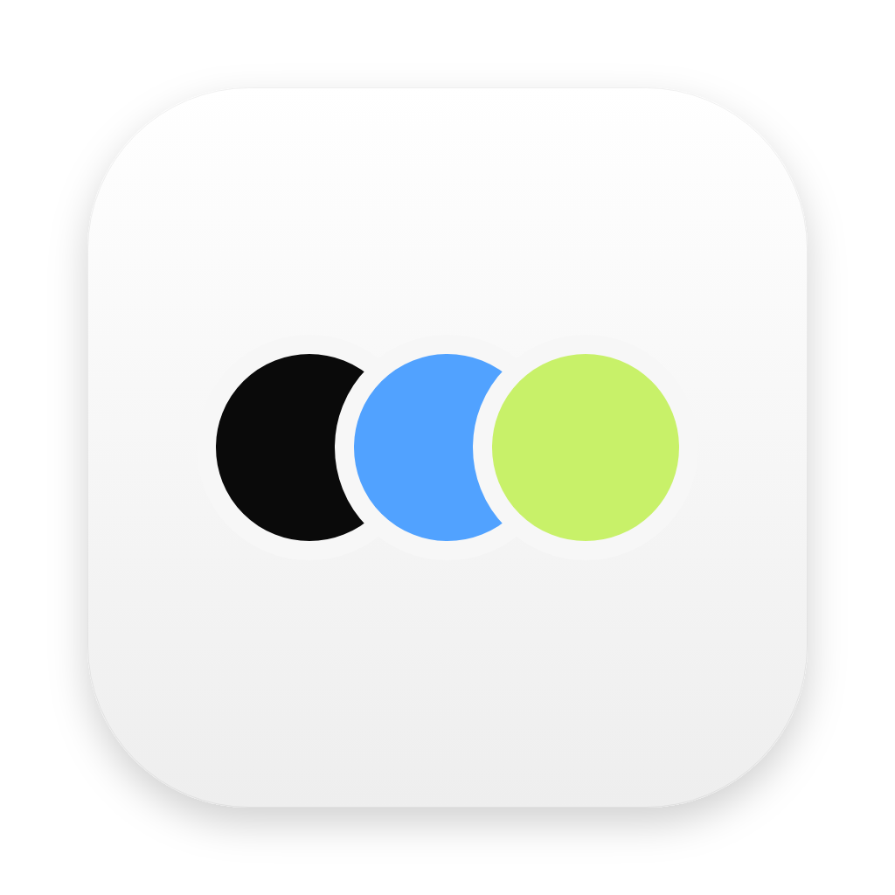

<p align="center"></p>
<h1 align="center">Codex-open-dot</h1>
<p align="center"><strong>Your models. Your workflows. Your personal AI agents.</strong><br/>A customized macOS agent app by Mohammad Aqib — Full Stack Developer.</p>
<p align="center">
  
  
  
</p>
<p align="center">
  <a href="#quick-start">Quick start</a> ·
  <a href="#what-you-can-do">Features</a> ·
  <a href="#models-and-voice">Models & voice</a> ·
  <a href="docs/ENHANCEMENTS.md">Documentation</a> ·
  <a href="#attribution-and-license">License & attribution</a>
</p>

---

**Codex-open-dot** brings model connections, task management, knowledge and action approvals into one desktop app. Create agents for different jobs, choose their models, follow their progress and review important actions.

This is **Mohammad Aqib's customized edition** of [Open Dot by Composio Community](https://github.com/composio-community/open-dot). It is an independent project, not an official OpenAI Codex product.

## What you can do

| Capability | Included in this edition |
| :--- | :--- |
| **Connect your models** | Custom Chat Completions and Responses endpoints, encrypted keys, manual model/deployment IDs and connection tests. |
| **Follow every task** | Durable task records, progress, results, explicit recovery and a task dashboard. |
| **Schedule work** | Explicit time zones, missed-run policies and durable dispatch records. |
| **Control execution** | Model spending estimates and limits, step limits, bounded read retries and exact-action approvals. |
| **Bring your knowledge** | PDF, DOCX, text and folder imports; keyword search with source references; editable dot, personal and project memories. |
| **Reuse processes** | Ordered workflows with review gates, model routing and bounded specialist handoffs. |
| **Extend tools** | Streamable HTTP MCP servers and fixed JSON POST API connections. |
| **Check results** | Command-based quality checks with recorded evidence; tasks without checks remain labeled unverified. |
| **Manage your workspace** | Backup/restore, setup diagnostics, authenticated server mode, member roles and activity history. |

For scope, limits and verification evidence, read [the enhancement guide](docs/ENHANCEMENTS.md) and [the implementation checklist](ENHANCEMENT_PLAN.md).

## Quick start

### Run from source

Use **Node.js 24**, **pnpm 10.33.2**, and Google Chrome or Playwright Chromium for browser tools.

```sh
git clone https://github.com/aqibmohd271/Codex-open-dot.git
cd Codex-open-dot
pnpm install --frozen-lockfile
pnpm dev
```

Open **http://localhost:3100**.

1. Go to **Settings → Setup and diagnostics**.
2. Add an OpenAI, OpenRouter or custom compatible API provider.
3. Enter the actual model or deployment ID and test the connection.
4. Create a dot, choose its instructions and model, and send a small first task.
5. Review its result before enabling schedules or broader tool access.

**No API credentials are included.** Model and external-service usage are billed by their providers. See [.env.example](.env.example) for optional environment settings.

### Build the Mac app

```sh
pnpm desktop:build
```

The Apple Silicon installer is generated at:

```text
dist/Codex-open-dot-0.2.0-arm64.dmg
```

Open the DMG and copy **Codex-open-dot.app** into Applications. Installers are built locally; this README does not imply a downloadable GitHub release exists.

The current development build is **ad-hoc signed and not Apple-notarized**. Use the normal macOS approval flow when prompted. See [Mac packaging notes](docs/MAC.md).

## Models and voice

| Connection | Agent text/tasks | Voice calls in the current app |
| :--- | :--- | :--- |
| Direct OpenAI API | Supported with an available compatible model | Uses OpenAI Realtime; a direct OpenAI key is required. |
| OpenRouter | Supported with compatible models | Not integrated through OpenRouter yet. |
| Custom API provider | Chat Completions or Responses, subject to deployment capabilities | Custom-provider voice is not implemented. |

Custom providers let you set a friendly name, base URL, authentication mode and real model/deployment IDs. Compatible Microsoft-hosted, DeepSeek-hosted or local deployments can be used. A model label alone does not establish tool, vision or audio support.

Voice can use OpenAI while the working agent uses another configured model. The proposed DeepSeek/local-speech fallback is **not yet implemented**. Strict model spending enforcement currently disables voice because live audio costs cannot be reserved reliably.

## Data, permissions and runtime

- Desktop data: `~/Library/Application Support/Codex-open-dot/`.
- Development data: `.data/`, excluded from Git.
- Saved API credentials are encrypted through the app's vault.
- Local mode uses a workspace folder; **it is not an operating-system sandbox**.
- Closing the desktop window keeps the app running; quitting or sleeping the Mac interrupts local work.
- Continuous off-device operation requires a separately deployed server. A cloud browser alone does not keep the scheduler running.
- Backups exclude credentials and browser profiles, but chat and document content can still be sensitive.

See [server deployment](docs/SERVER.md) for authentication, HTTPS, persistence and the single-process requirement.

## Development and verification

```sh
pnpm test
pnpm typecheck
pnpm lint
pnpm desktop:build
```

The 0.2.0 verification run passed **29 automated tests**, lint, production build/type checks and installer integrity checks. Tests cover mocked model requests, approval replay protection, scheduling, MCP, PDF/DOCX extraction, memory, backups, specialist limits, quality checks and mocked voice events.

These are recorded local results, not a live CI badge or a guarantee for every deployment. Real provider credentials, live microphone/browser sessions, Docker deployment, notarization and automatic updates require further setup or verification.

<details>
<summary><strong>Project structure</strong></summary>

```text
electron/           macOS desktop shell
src/app/            pages, server actions and API routes
src/components/     task, workflow, settings and chat interfaces
src/server/agent/   model adapters, agent runtime and tools
src/server/         persistence, knowledge, budgets, schedules and auth
tests/              automated tests and browser smoke test
docs/               setup, operating limits and attribution
```

</details>

## Feedback

Found a reproducible problem or have an improvement in mind? [Open an issue](https://github.com/aqibmohd271/Codex-open-dot/issues) with the steps and expected behavior. Remove keys, passwords and private chat content from logs and screenshots.

## Author

**[Mohammad Aqib](https://github.com/aqibmohd271) — Full Stack Developer**

Custom-edition developer and maintainer.

## Attribution and license

Based on **Composio Community's Open Dot**, imported at revision `f838e17cf5c3a88ade5ceea54680a8145d048c1d`. See [ATTRIBUTION.md](ATTRIBUTION.md) and [the original upstream README](docs/UPSTREAM_README.md).

[LICENSE.md](LICENSE.md) applies MIT terms **only to original contributions by Mohammad Aqib**, to the extent he holds those rights. No license file was found in the imported upstream revision or the repository checked on 2026-10-04. This does not make the combined project wholly MIT-licensed; upstream permissions remain unresolved. Third-party dependencies and assets retain their own licenses.

This project is not affiliated with or endorsed by OpenAI or Composio.
